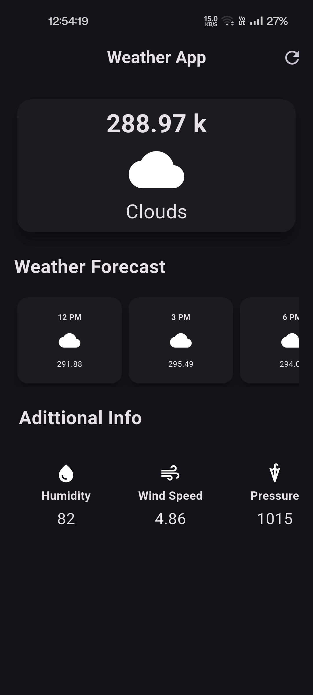

🌦️ Simple Weather App

A basic Flutter weather app that fetches and displays the current weather conditions for a single predefined city.Understanding API integration and Flutter UI development.

---

📌 Features

☁️ Shows current weather for a city.

🌡️ Displays temperature, weather condition, and more

🔗 Integrates with a public weather API (OpenWeatherMap)

📱 Clean and responsive UI built with Flutter

---

📷 Screenshot

<!-- Replace with your actual image path -->

  

---

🔧 Technologies Used

Flutter

Dart

REST API (e.g., OpenWeatherMap)

HTTP Package

---

🚀 Getting Started

1. Clone the repository

git clone https://github.com/mauryamj/weatherapp.git

2. Install dependencies

flutter pub get

3. Run the app

flutter run

4. Replace the city name and API key in weather_service.dart (or wherever applicable).

---

🎯 Future Plans

🔍 Add search functionality to change city

📍 Add GPS-based location detection

🌙 Add themes (light/dark)

📊 Show hourly/weekly forecasts

---

🧑‍💻 Author

[Abhishek Maurya]

---

📄 License

This project is open source and available under the MIT License.
